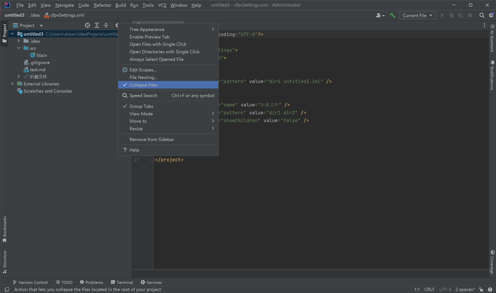
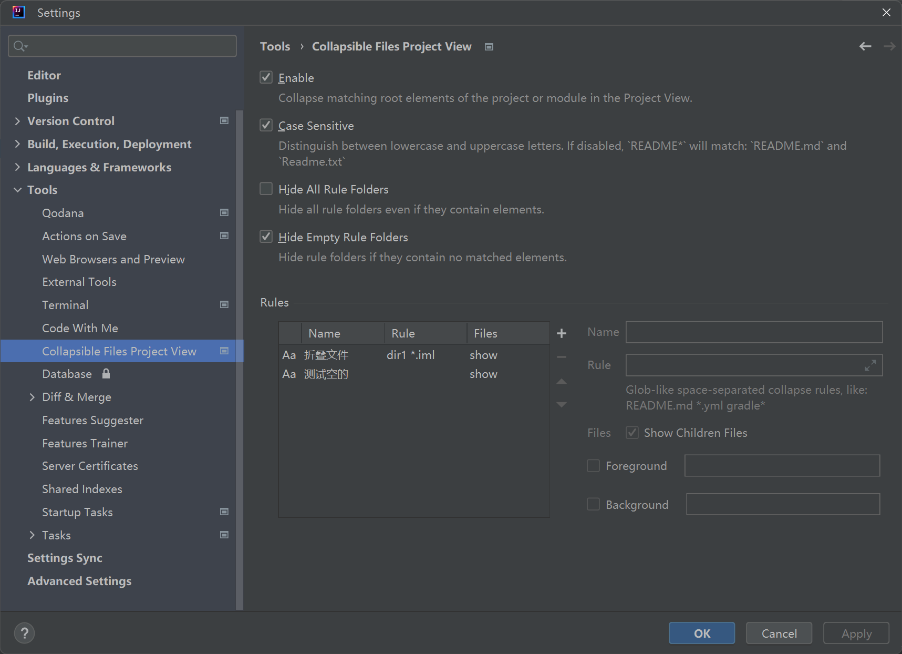

# Collapsible Files Project View

<!-- Plugin description -->

The Collapsible Files Project View is a plugin for the IntelliJ-based IDEs that lets you fold files located in the root of your
project.

Based on the [hsz/Foldable Project View](https://github.com/hsz/intellij-foldable-project-view)
 and the [pavankjadda/Foldable Project View](https://github.com/pavankjadda/intellij-foldable-project-view)

Improvments:

- Hide all rule folders
- Hide empty rule folders
- Save settings base on ide, no longer need to set up per project
- Add a switch to enable/disable to display hidden dir children files
- Fix bug

<!-- Plugin description end -->

## Screenshots

### Project View

### Preferences

## Installation

- Using IDE built-in plugin system:

  <kbd>Settings/Preferences</kbd> > <kbd>Plugins</kbd> > <kbd>Marketplace</kbd> > <kbd>Search for "Collapsible Files Project

  View"</kbd> >

  <kbd>Install Plugin</kbd>

- Manually:

  Download the [latest release](https://github.com/Skeaner/CollapsedFilesProjectView/releases) and
  install it manually using
  <kbd>Settings/Preferences</kbd> > <kbd>Plugins</kbd> > <kbd>⚙️</kbd> > <kbd>Install plugin from disk...</kbd>

---
Plugin based on the [IntelliJ Platform Plugin Template][template].

[template]: https://github.com/JetBrains/intellij-platform-plugin-template
